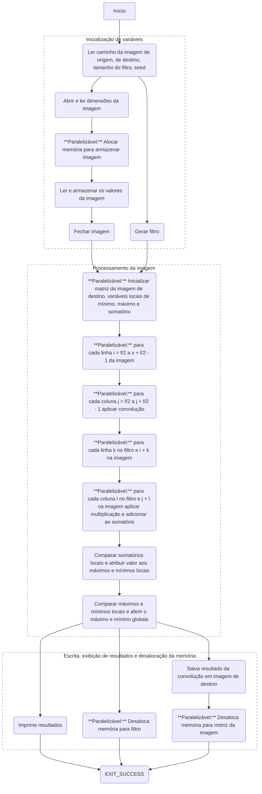
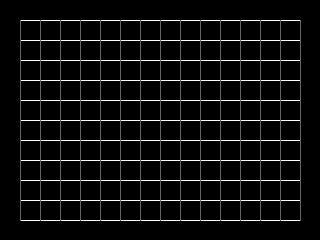
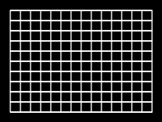
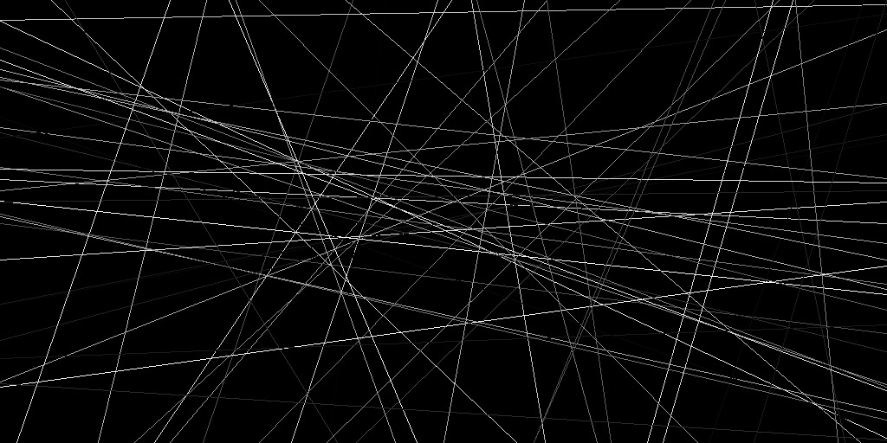
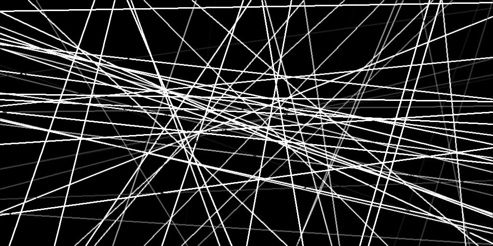

# Trabalho Prático 1: Convolução
| Autores                    | nUSP     |
| :---                       | :---     |
| Guilherme de Abreu Barreto | 12543033 |
| Miguel Reis de Araújo      | 12752457 |

## Introdução
Conforme proposta projetual, desenvolvemos um algoritmo de convolução com programação paralela por meio da metodologia PCAM (*Partitioning, Communication, Aglomeration, Mapping*). O algoritmo foi desenvolvido em duas versões: uma para submissão à plataforma de avaliação RunCodes, conforme especificado, e outra para aplicação sobre uma imagens em formato `.pgm`: um formato de arquivo para imagens rasterizadas monocromáticas.

À seguir são descritos o processo de aplicação do PCAM, o algoritmo em sua segunda versão e o resultado da aplicação sobre algumas imagens de amostra.

## PCAM
### Particionamento

Parte do algorítimo é paralelizada por dados e outra parte por instrução. Observa-se no grafo abaixo, onde as tarefas que geram múltiplas tarefas indicam paralelização por instrução e as tarefas que estão anotadas com `**Paralelizável**`, indicam paralelização por dados.

Existe uma tarefa para ler as dimensões da imagem que gera outra tarefa para ler as dimensões do filtro. A última tarefa gera duas outras tarefas, uma para alocar a memória para armazenar a imagem e outra para ler o endereço da imagem de destino, que por sua vez irá gerar uma tarefa para ler o seed, que irá gerar uma tarefa para gerar o filtro.

Na alocação de memória são geradas 3 sub-tarefas. Uma das tarefas é responsável por criar uma "borda" de tamanho `f/2` (onde `f` é a dimensão do filtro) zerada na parte superior da imagem, uma é responsável por criar uma borda de mesmo tamanho na parte inferior e a terceira é responsável por preencher a parte central da imagem. As três tarefas podem ser paralelizadas para cada linha dentro do seu domínio.

Umas das três novas tarefas geradas é responsável por preencher as `f/2` colunas laterais esquerdas com `0`, criando uma borda do lado esquerdo da imagem, outra é responsável por preencher a borda do lado direito e a terceira é responsável por armazenar o valor da imagem na posição respectiva dentro das bordas. Essas três tarefas também podem ser paralelizadas para cada coluna dentro do seu domínio.

Após a inicialização da imagem, partimos para o processamento, onde, para cada pixel da imagem, nós inicializamos uma variável local de somatório e aplicamos a convolução de forma paralela.

A convolução aplica a multiplicação e adiciona a variável somatório, paralelamente, para cada pixel do filtro. Cada thread executada paralelamente tem sua própria variável `sum` local e ao final é feita a redução para unificar a variável.

Depois de aplicar a convolução, nós comparamos os somatórios e atribuímos os valores máximos e mínimos locais de cada thread, e depois comparamos esses valores para atribuir os valores globais.

Em seguida, partimos pra o salvamento e a exibição dos resultados, onde geramos tarefas para desalocar a memória do filtro, salvar o resultado da convolução em uma imagem de destino, desalocar a memória da imagem e imprimir os resultados, finalizado a execução do programa ao final desses processos.

### Comunicação

Conforme pode ser observado no grafo, o algoritmo pode ser dividido em três grandes etapas; na execução do código elas são separadas por barreiras de sincronização.

Inicialmente, as dimensões obtitas pela entrada são enviadas para respectivas tarefas, que geram a imagem e o filtro de forma paralela.

Para fazer o processamento da imagem, primeiro é necessário garantir que temos tanto a imagem quanto o filtro disponiveis, portanto precisamos fazer uma sincronização nessa etapa, que será feita através de uma barreira.

Em seguida se inicia o processamento da imagem, que recebe os dados das tarefas anteriores e distribui para as respectivas tarefas que aplicam a convolução em cada pixel. Ao final do processamento é necessário outra barreira para garantir que todas as tarefas completaram antes de seguirmos para a próxima etapa. Também são utilizadas operações de redução para unificar o resultado da convolução e identificar o máximo e minimo global.

A etapa de exibição recebe o resultado da convolução das tarefas anteriores, o máximo e minimo global, salva o resultado na imagem de destino e imprime o máximo e minimo global.

### Aglomeração

Este método de aglomeração utiliza uma plataforma MIMD (Múltiplas Instruções, Múltiplos Dados) com memória compartilhada, porém com um número limitado de processadores. Para maximizar a eficiência com poucos processadores, a granularidade das tarefas é aumentada, atribuindo maior carga de trabalho a cada uma. É criada uma correspondência direta (1:1) entre o número de processos e o número de elementos de processamento disponíveis.

O processamento das matrizes é dividido em blocos de tarefas, que são então submetidos a um pool. Este pool gerencia a alocação dos blocos aos processadores disponíveis. Dependendo do tamanho da imagem, das dimensões do filtro e dos recursos computacionais, esses blocos podem ser ainda mais subdivididos para processamento paralelo em blocos menores.

A estratégia de alocação de tarefas garante que cada thread acesse uma combinação única de índices, eliminando a necessidade de mecanismos de sincronização, como regiões críticas. Variáveis compartilhadas, como `sum`, `local_min` e `local_max`, são replicadas localmente para cada thread. Após o processamento individual, essas cópias locais são consolidadas através de um processo de redução.
### Mapeamento
A atribuição de tarefas é realizada de forma dinâmica. Cada unidade de processamento deve ser alocada para um processo, e essa gestão é responsabilidade do Sistema Operacional da máquina. A expectativa é que a distribuição seja uniforme entre os elementos de processamento. Quando uma unidade de processamento fica ociosa, ela consome um bloco de tarefas do pool de processamento.

## Algoritmo e aplicação
A seguir exibimos algumas imagens antes e após a aplicação da operação de convolução descrita pelo nosso [algoritmo](https://github.com/de-abreu/alto_desempenho/blob/main/trabalho_1/image-convolution.omp.c) com um filtro de tamanho `3` e seed `10`:

| Antes                           | Depois                                  |
| :---                            | :---                                    |
|  |  |
|  |  |
|  |  |

