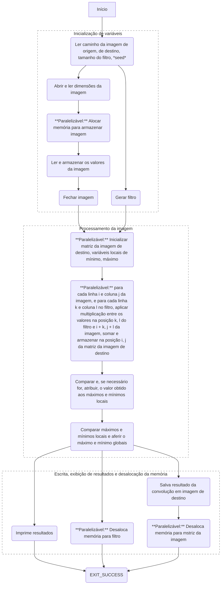
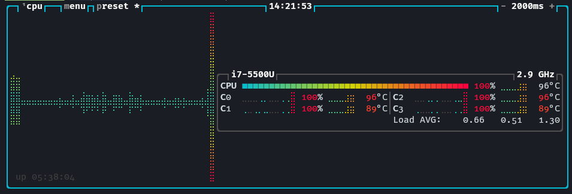
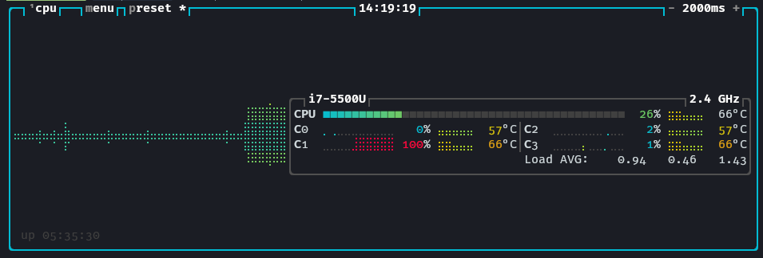

# Trabalho Prático 1: Convolução
| Autores                    | nUSP     |
| :---                       | :---     |
| Guilherme de Abreu Barreto | 12543033 |
| Miguel Reis de Araújo      | 12752457 |

## Introdução
Conforme proposta projetual, desenvolvemos um algoritmo de convolução com programação paralela por meio da metodologia PCAM (*Partitioning, Communication, Aglomeration, Mapping*). O algoritmo foi desenvolvido em duas versões: uma para submissão à plataforma de avaliação RunCodes, conforme especificado, e outra para aplicação sobre uma imagens em formato `.pgm`: um formato de arquivo para imagens rasterizadas monocromáticas.

À seguir são descritos o processo de aplicação do PCAM, o algoritmo em sua segunda versão e o resultado da aplicação sobre algumas imagens de amostra.

## PCAM
### Particionamento

Propomos que parte do algorítimo seja paralelizada por instrução e outra parte por dados. As tarefas as quais podem ser conduzidas em paralelismo de instrução seriam a inicialização e desalocação de memória de diferentes matrizes utilizadas para descrever as imagens de entrada, de saída, e o filtro; enquanto o paralelismo de dados pode ser aplicado ao processamento destas mesmas matrizes. Detalhamos no grafo abaixo oportunidades para o paralelismo de instrução com bifurcações no ciclo de execução e para o paralelismo de dados em instruções marcadas como `**Paralelizável**`.

O fluxo de execução inicia-se pela leitura sequencial dos parâmetros de entrada, que se segue a blocos de tarefas executados paralelamente para o armazenamento em memória da imagem a ser processada e a geração do filtro a ser aplicado.

O processamento da imagem inicia-se com a inicialização em paralelo de memória para armazenamento do resultado deste, assim como variáveis privadas de mínimo e máximo para cada thread gerada. Cada thread então opera a operação de convolução em diferentes regiões da imagem, e o resultado obtido calcula os valores locais de mínimo e máximo os quais, por uma operação de redução, inferem um mínimo e um máximo global.

Finalmente estes valores são exibidos ao usuário ao mesmo tempo que a imagem resultante é salva em memória e é feita a desalocação das matrizes utilizadas do processamento da imagem.



### Comunicação

Conforme pode ser observado no grafo, o algoritmo pode ser dividido em três grandes etapas; na execução do código elas são separadas por barreiras de sincronização.

Inicialmente, as dimensões obtidas pela entrada são enviadas para respectivas tarefas, que geram a imagem e o filtro de forma paralela.

Para fazer o processamento da imagem, primeiro é necessário garantir que temos tanto a imagem quanto o filtro disponíveis, portanto precisamos fazer uma sincronização nessa etapa, que será feita através de uma barreira.

Em seguida se inicia o processamento da imagem, que recebe os dados das tarefas anteriores e distribui para as respectivas tarefas que aplicam a convolução em cada pixel. Ao final do processamento é necessário outra barreira para garantir que todas as tarefas completaram antes de seguirmos para a próxima etapa. Também são utilizadas operações de redução para unificar o resultado da convolução e identificar o máximo e minimo global.

A etapa de exibição recebe o resultado da convolução das tarefas anteriores, o máximo e minimo global, salva o resultado na imagem de destino e imprime o máximo e minimo global.


### Aglomeração

Este método de aglomeração utiliza uma plataforma MIMD (Múltiplas Instruções, Múltiplos Dados) com memória compartilhada, porém com um número limitado de processadores. Para maximizar a eficiência com poucos processadores, a granularidade das tarefas é aumentada, atribuindo maior carga de trabalho a cada uma. É criada uma correspondência direta (1:1) entre o número de processos e o número de elementos de processamento disponíveis.

O processamento das matrizes é dividido em blocos de tarefas, que são então submetidos a um pool. Este pool gerencia a alocação dos blocos aos processadores disponíveis. Dependendo do tamanho da imagem, das dimensões do filtro e dos recursos computacionais, esses blocos podem ser ainda mais subdivididos para processamento paralelo em blocos menores.

A estratégia de alocação de tarefas garante que cada thread acesse uma combinação única de índices, eliminando a necessidade de mecanismos de sincronização, como regiões críticas. Variáveis compartilhadas, como `sum`, `local_min` e `local_max`, são replicadas localmente para cada thread. Após o processamento individual, essas cópias locais são consolidadas através de um processo de redução.
### Mapeamento
A atribuição de tarefas é realizada de forma dinâmica. Cada unidade de processamento deve ser alocada para um processo, e essa gestão é responsabilidade do Sistema Operacional da máquina. A expectativa é que a distribuição seja uniforme entre os elementos de processamento. Quando uma unidade de processamento fica ociosa, ela consome um bloco de tarefas do pool de processamento.

## Resultados obtidos
A seguir exibimos algumas imagens antes e após a aplicação da operação de convolução descrita pelo nosso [algoritmo](https://github.com/de-abreu/alto_desempenho/blob/main/trabalho_1/image-convolution.omp.c).  Executamos duas versões do algoritmo, uma com paralelismo e outra sem, com todas as demais otimizações desabilitadas, conforme os seguintes comandos passados ao `gcc` em sua versão `14.2.1`:

```sh
❯ gcc -fopenmp image-convolution.omp.c -o image-convolution.omp.o -O0
❯ gcc image-convolution.omp.c -o image-convolution_sequenctial.omp.o -O0
```
Para isso utilizamos uma máquina com as especificações:
```sh
❯ inxi -b
System:
  Host: endeavour Kernel: 6.10.10-arch1-1 arch: x86_64 bits: 64
  Desktop: GNOME v: 47.0 Distro: EndeavourOS
Machine:
  Type: Portable System: Dell product: Inspiron 5548 v: A10
    serial: <superuser required>
  Mobo: Dell model: 0YDTG3 v: A02 serial: <superuser required>
    UEFI-[Legacy]: Dell v: A10 date: 05/28/2019
Battery:
  ID-1: BAT1 charge: 4.4 Wh (100.0%) condition: 4.4/42.2 Wh (10.4%)
    volts: 11.4 min: 11.1
CPU:
  Info: dual core Intel Core i7-5500U [MT MCP] speed (MHz): avg: 908
    min/max: 500/3000
Graphics:
  Device-1: Intel HD Graphics 5500 driver: i915 v: kernel
  Device-2: Advanced Micro Devices [AMD/ATI] Topaz XT [Radeon R7 M260/M265
    / M340/M360 M440/M445 530/535 620/625 Mobile] driver: amdgpu v: kernel
  Device-3: Sunplus Innovation Integrated_Webcam_HD driver: uvcvideo
    type: USB
  Display: x11 server: X.Org v: 21.1.13 with: Xwayland v: 24.1.2 driver: X:
    loaded: amdgpu,modesetting unloaded: radeon dri: iris,radeonsi gpu: i915
    resolution: 1920x1080~60Hz
  API: OpenGL v: 4.6 compat-v: 4.5 vendor: intel mesa v: 24.2.3-arch1.1
    renderer: Mesa Intel HD Graphics 5500 (BDW GT2)
Network:
  Device-1: Realtek RTL810xE PCI Express Fast Ethernet driver: r8169
  Device-2: Intel Wireless 7265 driver: iwlwifi
Drives:
  Local Storage: total: 447.13 GiB used: 360.02 GiB (80.5%)
Info:
  Memory: total: 16 GiB available: 15.54 GiB used: 3.15 GiB (20.3%)
  Processes: 250 Uptime: 5h 39m Shell: fish inxi: 3.3.36
```
Para um filtro de tamanho `3` e *seed* `10`, obtivemos:

| Teste | Antes | Depois | Paralelo (ms) | Sequencial (ms) |
| :---  | :--- | :--- | :--- | :--- |
| 1     |  |  | 59.93 | 16.96 |
| 2     |  |  | 59.12 | 19.64 |
| 3     |  |  | 377.99 | 108.82 |

> Onde o tempo descrito é o tempo "real" de execução.

Percebe-se que a execução estritamente sequencial foi mais ágil que aquela com várias threads. Tentamos novamente utilizando um filtro de tamanho `300` e mesmo *seed*:

| Teste | Antes | Depois | Paralelo (s) | Sequencial (s) |
| :--- | :--- | :--- | :--- | :--- |
| 1     |  |  | 21.03 | 33.34 |
| 2     |  |  | 20.18 | 32.86 |
| 3     |  |  | 153.32 | 246.29 |

A partir daqui já vemos ocorrer um ganho de velocidade. Atentando-se a execução do programa no monitor de processos, podemos observar que a versão paralela não permite que nenhum dos processadores fique ocioso:



Diferentemente da versão sequencial:



## Conclusão
Utilizando-se da metodologia PCAM fomos capazes de implementar com sucesso um algoritmo de convolução paralelo para eficientemente lidar com tarefas de processamento de imagem, ainda que dispondo de um número bastante limitado de processadores trabalhando em paralelo. Os testes do algoritmo em versão sequencial e paralela evidenciam que, embora o primeiro seja o mais rápido considerando filtros menores, quanto maior estes forem, também são maiores os ganhos em tempo de execução, dada a redução da ociosidade dos processadores disponíveis. Isso sugere haver um ponto de equilíbrio a determinar o número ótimo de processadores a serem utilizados para o processamento da imagem dados tamanhos discretos para o filtro.
