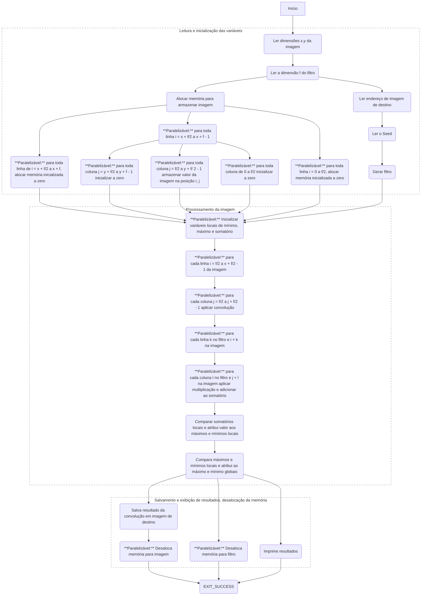

# Trabalho Prático 1: Convolução
## Particionamento

Parte do algoritimo é paralelizada por dados e parte é paralelizada por instrução. Se você observar o grafo abixo, as tarefas que geram multiplas tarefas indicam paralelização por instrução e as tarefas que estão anotadas como `**paralelizável**`, indicam paralelização por dados.

Existe uma tarefa para ler as dimensões da imagem que gera outra tarefa para ler as dimensões do filtro. A última tarefa gera duas outras tarefas, uma para alocar a memória para armazenar a imagem e outra para ler o endereço da imagem de destino, que por sua vez irá gerar uma tarefa para ler o seed, que irá gerar uma tarefa para gerar o filtro.

Na alocação de memória são geradas 3 sub-tarefas. Uma das tarefas é reponsável por criar uma "borda" de tamanho `f/2` (onde `f/2` é a dimensão do filtro) zerada na parte superior da imagem, uma é responsável por criar uma borda de mesmo tamanho na parte inferior e a terceira é reponsável por preencher a parte central da imagem. As três tarefas podem ser paralelizadas para cada linha dentro do seu domínio.

Umas das três novas tarefas geradas é responsável por preencher as `f/2` colunas laterais esquerdas com `0`, criando uma borda do lado esquerdo da imagem, outra das tarefas é responsável por preencher a borda do lado direito e a terceira é reponsável por armazenar o valor da imagem na posição respectiva dentro das bordas. Essas três tarefas também podem ser paralelizadas para cada coluna dentro do seu domínio.

Após a inicialização da imagem, partimos para o processamento, onde, para cada pixel da imagem, nós inicializamos uma variável local de somatório e aplicamos a convolução de forma paralela.

A convolução aplica a multiplicação e adiciona a variável somatório, paralelamente, para cada pixel do filtro. Cada thread executada paralelamente tem sua própria variável sum local e ao final é feita a redução para unificar a variável.

Depos de aplicar a convolução, nós comparamos os somatórios e tribuimos os valores maiximos e minimos locais de cada thread, e depois comparamos esses valores para atribuir os valores globais.

Em seguida, partimos pra o slvament e a exibição dos resultdos, onde geramos tarefas para desalocar a memória do filtrio, salvar o resultado da convulução em uma imagem de destino, desalocar a memória da imagem e imprimir os resultados, finalizado a execução do programa ao final desses processos.

## Comunicação
## Aglomeração
## Mapeamento
A atribuição de tarefas é realizada de forma dinâmica. Cada unidade de processamento deve ser alocada para um processo, e essa gestão é responsabilidade do Sistema Operacional da máquina. A expectativa é que a distribuição seja uniforme entre os elementos de processamento. Quando uma unidade de processamento fica ociosa, ela consome um bloco de tarefas do pool de processamento.
