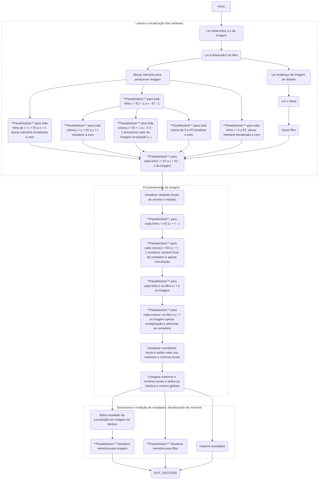

# Trabalho Prático 1: Convolução
## Particionamento

## Comunicação
## Aglomeração
## Mapeamento
A atribuição de tarefas é realizada de forma dinâmica. Cada unidade de processamento deve ser alocada para um processo, e essa gestão é responsabilidade do Sistema Operacional da máquina. A expectativa é que a distribuição seja uniforme entre os elementos de processamento. Quando uma unidade de processamento fica ociosa, ela consome um bloco de tarefas do pool de processamento.
